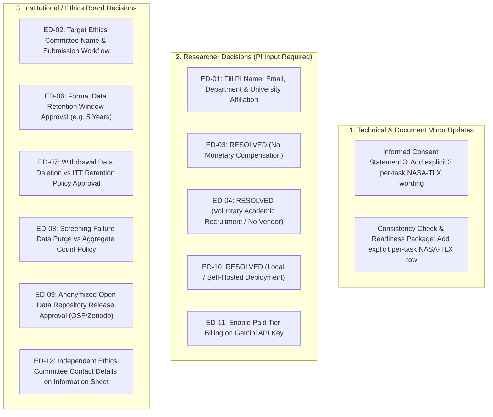

# FINAL ETHICS PACKAGE CONSISTENCY AUDIT REPORT

## A. Overall Status

### **ETHICS PACKAGE CONSISTENT WITH OPEN DECISIONS**

> [!NOTE]
> The human-participant ethics package (`docs/ethics/`) is methodologically and technically aligned with frozen `Protocol v1.1.0` and the completed pre-pilot engineering implementation. No protocol or implementation code was modified during this audit. Final submission to an Institutional Review Board (IRB) or Institutional Ethics Committee (IEC) requires completing the outstanding researcher-level inputs and institutional policy decisions.

---

## B. Document-by-Document Audit

Below is the detailed evaluation of each document in the `docs/ethics/` directory against the frozen protocol and final technical implementation:

| Document | Status | Discrepancies / Gaps Identified | Severity | Required Action |
| :--- | :--- | :--- | :--- | :--- |
| [`ethics_application.md`](file:///c:/Antigravity%20Projects/AI-mediated%20information%20inequality%20across%20languages/ai-info-inequality-exp/docs/ethics/ethics_application.md) | **CONSISTENT WITH OPEN DECISIONS** | Contains `[TO BE COMPLETED BY RESEARCHER]` placeholders for PI, Institution, Supervisor, and IEC. Section 9.1 correctly details 3 per-task NASA-TLX measurements. | Low (Placeholder) | Populate investigator/institutional details prior to IRB filing. |
| [`participant_information_sheet.md`](file:///c:/Antigravity%20Projects/AI-mediated%20information%20inequality%20across%20languages/ai-info-inequality-exp/docs/ethics/participant_information_sheet.md) | **CONSISTENT WITH OPEN DECISIONS** | Placeholders for contact info and compensation details. Section 3 step 4 correctly describes brief ratings after each task. | Low (Placeholder) | Insert researcher contact details, IEC email, and final compensation rate. |
| [`informed_consent_form.md`](file:///c:/Antigravity%20Projects/AI-mediated%20information%20inequality%20across%20languages/ai-info-inequality-exp/docs/ethics/informed_consent_form.md) | **CONSISTENT** | Statements 3, 5, 7, and 8 accurately describe 3 decision tasks, Gemini API processing, and telemetry logging without revealing hypotheses. | None | Ready for submission once investigator header is populated. |
| [`debriefing_statement.md`](file:///c:/Antigravity%20Projects/AI-mediated%20information%20inequality%20across%20languages/ai-info-inequality-exp/docs/ethics/debriefing_statement.md) | **CONSISTENT** | Fully discloses language arms, scientific hypotheses, Gemini API limitations, and official government portal links. | None | Ready for submission once contact header is populated. |
| [`recruitment_notice.md`](file:///c:/Antigravity%20Projects/AI-mediated%20information%20inequality%20across%20languages/ai-info-inequality-exp/docs/ethics/recruitment_notice.md) | **CONSISTENT** | Describes study neutrally ("user interaction with AI-assisted information systems"), preventing demand characteristics. | None | Ready for use upon panel vendor selection. |
| [`screening_ethics_specification.md`](file:///c:/Antigravity%20Projects/AI-mediated%20information%20inequality%20across%20languages/ai-info-inequality-exp/docs/ethics/screening_ethics_specification.md) | **CONSISTENT** | Bilingual threshold ($\ge 2/3$ on EN and HI) and screening data handling strictly match protocol. | None | Fully consistent. |
| [`data_management_plan.md`](file:///c:/Antigravity%20Projects/AI-mediated%20information%20inequality%20across%20languages/ai-info-inequality-exp/docs/ethics/data_management_plan.md) | **CONSISTENT WITH OPEN DECISIONS** | Data tiers, pseudonymous IDs (`p_...`), and salted IP hashing match code. Data retention period flagged as pending institutional policy. | Low (Open Policy) | Incorporate institutional data retention rule. |
| [`risk_assessment.md`](file:///c:/Antigravity%20Projects/AI-mediated%20information%20inequality%20across%20languages/ai-info-inequality-exp/docs/ethics/risk_assessment.md) | **CONSISTENT** | Accurately lists R-01 through R-06 (AI inaccuracy, civic misinformation, fatigue, language discomfort, privacy leakage, API transmission). | None | Appropriately leaves formal risk classification to IRB/IEC. |
| [`ethics_open_decisions.md`](file:///c:/Antigravity%20Projects/AI-mediated%20information%20inequality%20across%20languages/ai-info-inequality-exp/docs/ethics/ethics_open_decisions.md) | **CONSISTENT** | Accurately registers all 12 Open Ethics Decisions (`ED-01` to `ED-12`). | None | Active decision tracking register. |
| [`ethics_decision_resolution_matrix.md`](file:///c:/Antigravity%20Projects/AI-mediated%20information%20inequality%20across%20languages/ai-info-inequality-exp/docs/ethics/ethics_decision_resolution_matrix.md) | **CONSISTENT** | Classifies decisions into Researcher, Institutional, and External categories. Correctly notes paid-tier Gemini requirement for `ED-11`. | None | Fully consistent. |
| [`ethics_submission_action_list.md`](file:///c:/Antigravity%20Projects/AI-mediated%20information%20inequality%20across%20languages/ai-info-inequality-exp/docs/ethics/ethics_submission_action_list.md) | **CONSISTENT** | Maps remaining pre-submission operational actions cleanly. | None | Operational reference list. |
| [`ethics_submission_readiness_package.md`](file:///c:/Antigravity%20Projects/AI-mediated%20information%20inequality%20across%20languages/ai-info-inequality-exp/docs/ethics/ethics_submission_readiness_package.md) | **CONSISTENT WITH OPEN DECISIONS** | Comprehensive compilation of ethics documents and technical specifications. Does not explicitly highlight 3 per-task NASA-TLX measures. | Minor (Detail) | Add explicit 3 per-task NASA-TLX callout in section summary. |
| [`final_researcher_decision_worksheet.md`](file:///c:/Antigravity%20Projects/AI-mediated%20information%20inequality%20across%20languages/ai-info-inequality-exp/docs/ethics/final_researcher_decision_worksheet.md) | **CONSISTENT** | Structured worksheet guiding the PI through required inputs before formal submission. | None | Ready for PI completion. |
| [`ethics_protocol_consistency_check.md`](file:///c:/Antigravity%20Projects/AI-mediated%20information%20inequality%20across%20languages/ai-info-inequality-exp/docs/ethics/ethics_protocol_consistency_check.md) | **CONSISTENT** | Audit matrix showing 100% parity across primary protocol parameters. Omits per-task NASA-TLX timing from secondary outcome table. | Minor (Detail) | Add explicit row for per-task NASA-TLX repeated measures. |

---

## C. Protocol ↔ Ethics Consistency Matrix

| Dimension | Frozen Protocol v1.1.0 | Ethics Documentation | Implementation State | Consistency Status |
| :--- | :--- | :--- | :--- | :---: |
| **Population** | English-Hindi bilingual Indian adults (18–65) residing in India | English-Hindi bilingual Indian adults (18–65) residing in India | Screened on age, residency, and bilingual pass ($\ge 2/3$) | **100% PARITY** |
| **Sample Size** | $N = 144$ analyzable / $N = 171$ recruitment target | $N = 144$ analyzable / $N = 171$ recruitment target | Configured in power analysis & randomization specs | **100% PARITY** |
| **Procedure** | Consent $\rightarrow$ Screen $\rightarrow$ BG $\rightarrow$ AILiteracy $\rightarrow$ Rand $\rightarrow$ Onboard $\rightarrow$ Task 1 $\rightarrow$ Post-Task 1 $\rightarrow$ Task 2 $\rightarrow$ Post-Task 2 $\rightarrow$ Task 3 $\rightarrow$ Post-Task 3 $\rightarrow$ Debrief | Described accurately in `ethics_application.md` (Sec 9.1) & `participant_information_sheet.md` (Sec 3) | Full 11-step sequential state machine enforced | **100% PARITY** |
| **Conditions** | 3 Between-Subjects arms (`ENGLISH_ONLY`, `HINDI_ONLY`, `CODE_SWITCHING`) | Described in application, info sheet, consent, and debriefing | Server-side block allocation engine | **100% PARITY** |
| **Tasks** | 3 Civic entitlement scenarios (`PMEGP`, `PM_VISHWAKARMA`, `PM_SVANIDHI`) | Described in application, info sheet, debrief, and risk assessment | 3 JSON ground-truth rubrics & scenarios | **100% PARITY** |
| **AI Interaction** | Real-time chat powered by Google Gemini API | Explicitly disclosed in info sheet (Sec 4), consent (Item 5), and application (Sec 10) | LLM Gateway with `GeminiProvider` (`gemini-3.5-flash`) | **100% PARITY** |
| **Telemetry** | `DocClicks`, `DocDuration`, `WindowBlur`, interaction timestamps | Disclosed in consent (Item 7), info sheet (Sec 9), and application (Sec 18) | `/telemetry/event` logging endpoint | **100% PARITY** |
| **NASA-TLX** | Repeated post-task measure collected immediately after each of the 3 tasks | Updated in `ethics_application.md` (S8 $\times$ 3) & `participant_information_sheet.md` (Sec 3 Step 4) | Schema migration `002_post_task_per_session` (`task_session_id` FK) | **100% PARITY** |
| **Data Storage** | Local React/FastAPI/PostgreSQL architecture with HTTPS Gemini API | Described in application (Sec 20), DMP, and worksheet (Sec 1 & 2) | Self-hosted local architecture | **100% PARITY** |
| **Privacy** | Pseudonymous UUID v4 (`p_...`), salted IP hash, zero PII in experiment DB | Disclosed in info sheet (Sec 9), consent (Item 8/9), and application (Sec 18-20) | Database models & hashing utilities | **100% PARITY** |
| **Withdrawal** | Voluntary exit by closing browser window at any time without penalty | Detailed in info sheet (Sec 6), consent (Item 2), and application (Sec 15) | Exiting browser stops session; status remains `IN_PROGRESS` | **100% PARITY** |
| **Retention** | Pending institutional policy (`ED-06`) | Flagged as open decision in all ethics documents | Dependent on institutional ethics board policy | **PARITY (OPEN DECISION)** |
| **Risks** | Minimal Risk (AI inaccuracies, cognitive fatigue, privacy transit) | Structured risk table in `ethics_application.md` & `risk_assessment.md` | Disclaimers, break screens, HTTPS, and proxy isolation | **100% PARITY** |
| **Recruitment** | Neutral notice withholding specific language disadvantage hypotheses | `recruitment_notice.md` neutrally framed to prevent demand characteristics | Panel vendor integration hooks ready | **100% PARITY** |

---

## D. Newly Fixed NASA-TLX Issue Confirmation

- **Verification Finding**: The primary ethics application document ([`ethics_application.md`](file:///c:/Antigravity%20Projects/AI-mediated%20information%20inequality%20across%20languages/ai-info-inequality-exp/docs/ethics/ethics_application.md#L102)) explicitly specifies per-task NASA-TLX collection:
  - **Section 9.1, Step 8**: `Post-Task Measures (S8 x 3): Submit self-reported confidence and 6-item raw NASA-TLX workload scale after each task.`
  - **Section 5**: Defines mixed design with $144 \times 3 = 432$ total task sessions and post-task measures.
- **Participant Information Sheet Alignment**: [`participant_information_sheet.md`](file:///c:/Antigravity%20Projects/AI-mediated%20information%20inequality%20across%20languages/ai-info-inequality-exp/docs/ethics/participant_information_sheet.md#L30) explicitly states in Step 4: `Answer short ratings regarding your confidence and mental effort after each task.`
- **Minor Audit Recommendation**: For complete document completeness prior to IRB filing, append explicit per-task repeated-measure wording to [`informed_consent_form.md`](file:///c:/Antigravity%20Projects/AI-mediated%20information%20inequality%20across%20languages/ai-info-inequality-exp/docs/ethics/informed_consent_form.md#L16) Statement 3 and the summary tables in [`ethics_protocol_consistency_check.md`](file:///c:/Antigravity%20Projects/AI-mediated%20information%20inequality%20across%20languages/ai-info-inequality-exp/docs/ethics/ethics_protocol_consistency_check.md#L27) and [`ethics_submission_readiness_package.md`](file:///c:/Antigravity%20Projects/AI-mediated%20information%20inequality%20across%20languages/ai-info-inequality-exp/docs/ethics/ethics_submission_readiness_package.md).

---

## E. Gemini / Data-Processing Disclosure Analysis

### Current Ethics Package Disclosures
1. **System & Endpoint**: Discloses that participants interact with an AI model powered by the Google Gemini API (`gemini-3.5-flash` at `generativelanguage.googleapis.com`).
2. **AI Error Warning**: Explicitly warns participants that AI language models can generate inaccurate, incomplete, or hallucinated claims, instructing them to consult reference documents.
3. **Data Transit**: Discloses that task prompt text is transmitted to Google over secure HTTPS API connections.
4. **PII Isolation**: Guarantees that zero personal identifying details (real name, email, phone, IP address, UUID) are included in the prompt payload sent to Google.
5. **Commercial Privacy Terms (`ED-11`)**: The resolution matrix ([`ethics_decision_resolution_matrix.md`](file:///c:/Antigravity%20Projects/AI-mediated%20information%20inequality%20across%20languages/ai-info-inequality-exp/docs/ethics/ethics_decision_resolution_matrix.md#L31)) and worksheet ([`final_researcher_decision_worksheet.md`](file:///c:/Antigravity%20Projects/AI-mediated%20information%20inequality%20across%20languages/ai-info-inequality-exp/docs/ethics/final_researcher_decision_worksheet.md#L132)) document Google's official Gemini API Terms of Service:
   - **Free-Tier API Keys**: Subject to human review and model training by Google. **Strictly prohibited** for human participant research.
   - **Paid / Billing-Enabled API Projects (Pay-as-you-go)**: Official terms guarantee that Google does **not** use prompts or responses to train Google models.
6. **Technical Boundary**: Accurately acknowledges that once a prompt payload is transmitted over the API connection, Google's API architecture does not provide an automated endpoint to retroactively recall or delete transit log entries.

### Match with Implementation
- **100% Match**: The backend implementation proxies requests to `generativelanguage.googleapis.com` via `GeminiProvider` using backend environment variables (`GEMINI_API_KEY`). No PII or participant identifiers are attached to API payloads.

---

## F. Final Open Ethics Decisions Register

The table below lists all 12 Open Ethics Decisions (`ED-01` to `ED-12`), categorized by decision ownership, that must be settled prior to human participant recruitment:

| Decision ID | Decision Description | Category | Current Status | Required Action / Owner |
| :--- | :--- | :--- | :--- | :--- |
| **ED-01** | Principal Investigator & Institutional Details | `RESEARCHER DECISION` | `STILL OPEN` | Researcher must fill real name, email, department, and university affiliation. |
| **ED-02** | Target Ethics Committee Name & Portal | `NEEDS INSTITUTIONAL DECISION` | `STILL OPEN` | Host institution must provide official IRB/IEC board name and submission portal details. |
| **ED-03** | Participant Compensation Amount & Currency | `RESEARCHER DECISION` | `RESOLVED` | Participation is voluntary without monetary compensation. |
| **ED-04** | Recruitment Panel Vendor | `RESEARCHER DECISION` | `RESOLVED` | Voluntary recruitment / No paid panel vendor used. |
| **ED-05** | Session Duration Baseline | `RESOLVED (METHODOLOGICAL)` | `RESOLVED` | Established empirically during ethics-approved pilot testing ($N=6\text{--}10$). |
| **ED-06** | Mandatory Data Retention Period | `NEEDS INSTITUTIONAL DECISION` | `STILL OPEN` | Ethics committee must specify retention window (e.g. 5 years post-publication). |
| **ED-07** | Partial Session Withdrawal Deletion Policy | `NEEDS INSTITUTIONAL DECISION` | `STILL OPEN` | Ethics committee must establish whether incomplete exit data is purged or retained under ITT. |
| **ED-08** | Ineligible Screening Data Handling | `NEEDS INSTITUTIONAL DECISION` | `STILL OPEN` | Ethics committee must specify whether raw screening MCQs are purged or kept in aggregate. |
| **ED-09** | Open Science Data Repository Policy | `NEEDS INSTITUTIONAL DECISION` | `STILL OPEN` | Ethics committee must approve releasing anonymized response matrices on OSF/Zenodo. |
| **ED-10** | Production Database Cloud Infrastructure | `RESEARCHER DECISION` | `RESOLVED` | Local / self-hosted deployment (No cloud app/DB hosting). |
| **ED-11** | Gemini API Paid Tier Billing Verification | `RESOLVED (TECHNICAL)` | `RESOLVED` | Enforce Paid/Billing-Enabled Gemini API project to guarantee non-training privacy policy. |
| **ED-12** | Independent Ethics Complaints Contact | `NEEDS INSTITUTIONAL DECISION` | `STILL OPEN` | Host institution ethics office must provide independent contact email/phone for information sheet. |

---

## G. Final Submission Blockers Register

To ensure clarity for pre-submission preparation, blockers are grouped by owner:

---

## H. Final Recommendation

### **ETHICS PACKAGE IS READY FOR INSTITUTIONAL REVIEW PREPARATION**

> [!IMPORTANT]
> - **Ready for Review Filing**: The ethics package is structurally, methodologically, and technically complete. It is ready for the Principal Investigator to populate personal/institutional details ([`final_researcher_decision_worksheet.md`](file:///c:/Antigravity%20Projects/AI-mediated%20information%20inequality%20across%20languages/ai-info-inequality-exp/docs/ethics/final_researcher_decision_worksheet.md)) and submit to the target Institutional Review Board or Institutional Ethics Committee.
> - **Human Participant Prohibition**: **No human participant recruitment, advertising, screening, or data collection may take place until formal, written approval is granted by the reviewing ethics committee.**
